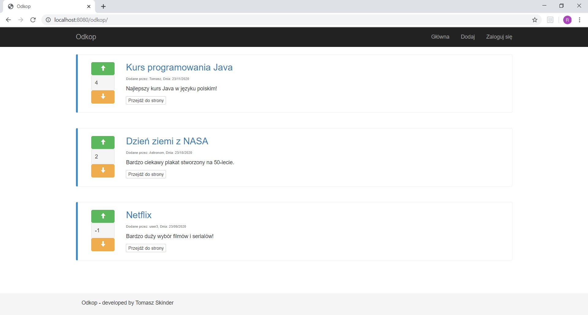
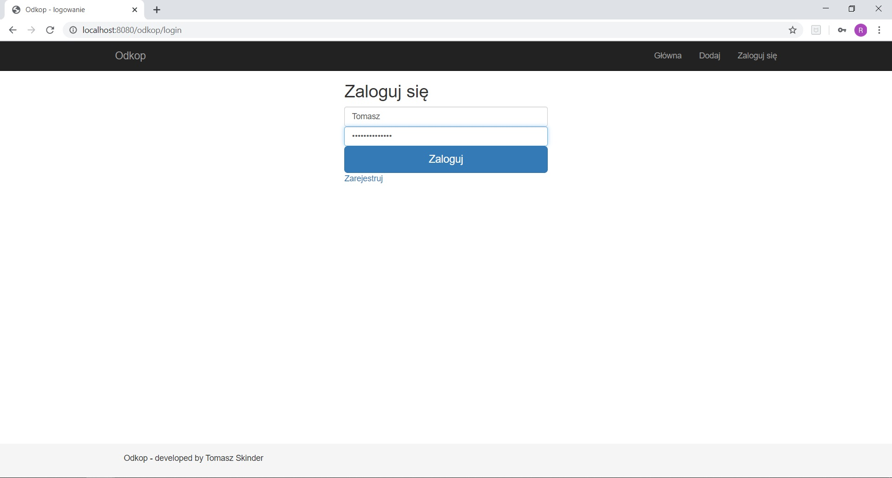
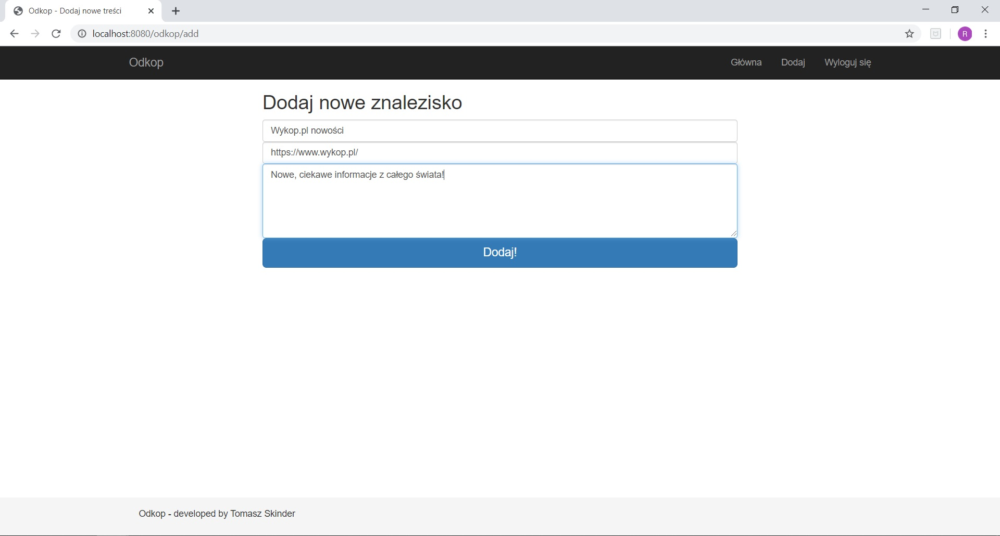
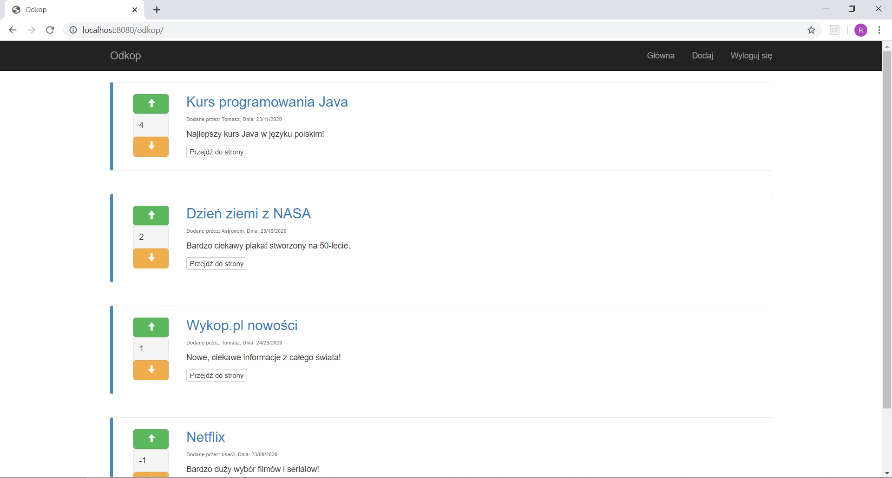

# Odkop #
Application created as part of the JavaEE course. Odkop is created on the example of the website wykop.pl.
Users have the option of registering. Logged in users can add and rate discovery. 
The highest rated discoveries are the highest in the ranking. User data, discoveries and votes cast are stored in a database.

##  Screenshots ##

## Technologies ##
Project is created with:
- JavaEE
- Java Standard Tag library
- Expression Language
- Spring JDBC 
- Bootstrap 3
- CSS 5
- MySQL
- Tomcat v9.0
